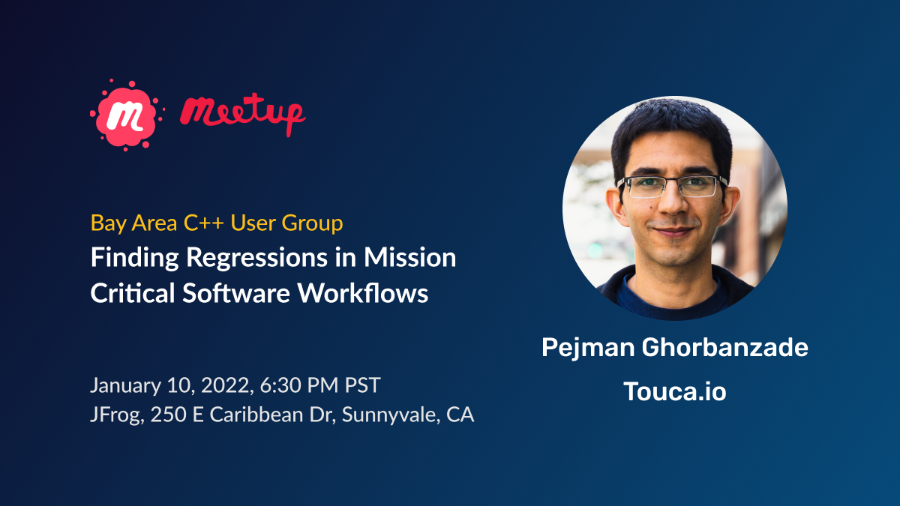

# Public Speaking

## Speaker Bio

Pejman Ghorbanzade is the Founder and CEO of [Touca.io](https://touca.io/), helping engineering teams find the unintended side-effects of their day to day code changes on the behavior and performance of their software.

Before Touca, Pejman was a senior software engineer at Canon Medical Informatics building software for advanced visualization of medical images. Before that, he was a software engineer at VMware Carbon Black.

Pejman is interested in problems related to the design and maintenance of software at scale and over time. He is passionate about solutions to improve stability and maintainability of products with large ever-changing code bases.

## Social Links

- [Profile Pictures](https://github.com/ghorbanzade/talks/tree/main/assets)
- [Twitter](https://twitter.com/heypejman)
- [GitHub](https://github.com/ghorbanzade)
- [LinkedIn](https://linkedin.com/in/ghorbanzade)
- [Website](https://pejman.dev)

## Previous Talks

> [Playlist of recorded talks on YouTube](https://www.youtube.com/playlist?list=PL5-_QXYHJoVR99sDXo56_EFaIY4TE5rYj)

### January 10, 2023

San Francisco Bay Area C++ User Group

Finding regressions in mission critical software workflows

- [Registration Link](https://www.meetup.com/cpp-bay-area/events/290564227/)
- Slides ([html](https://touca.io/talks/cppbay23/), [pdf](https://touca.io/talks/cppbay23/slides-cppbay23-pejman.pdf))

### May 12, 2022

Twin Cities Python User Group

Building Developer-Friendly Command-Line Tools in Python

- [Registration Link](https://www.meetup.com/PyMNtos-Twin-Cities-Python-User-Group/events/285705542/)

### May 5, 2022

Chicago Java User Group

Continuous Regression Testing in Java

- [Registration Link](https://www.meetup.com/ChicagoJUG/events/285406777/)
- Slides ([html](https://touca.io/talks/cjug22/), [pdf](https://touca.io/talks/cjug22/slides-cjug22-pejman.pdf))

### April 13, 2022

Denver Java User Group

Improving Developer Productivity through Continuous Regression Testing

- [Registration Link](https://www.meetup.com/DenverJavaUsersGroup/events/cpmtcqydcgbrb/)
- [YouTube Video](https://www.youtube.com/watch?v=6LtgbTdUJEQ)
- Slides ([html](https://touca.io/talks/djug22), [pdf](https://touca.io/talks/djug22/slides-djug22-pejman.pdf))

### April 6, 2022

Twin Cities Test Automation Group

Continuous Regression Testing, Benefits and Challenges

- [Registration Link](https://www.meetup.com/TC-TAG/events/284654695/)

### March 28, 2022

Prime Digital Academy Alumni

Software Testing Best Practices

### March 15, 2022

Java MN User Group

Continuous Regression Testing in Java

- [Registration Link](https://www.meetup.com/Java-User-Group-Hosted-by-TEKsystems/events/284076315/)

### November 11, 2021

Jersey City Java User Group

Continuous Regression Testing Using Touca SDK for Java

- [Registration Link](https://www.meetup.com/Jersey-City-Java-User-Group-JC-JUG/events/281715735/)
- [YouTube Video](https://youtu.be/Nn5We6yQ8Kg)

### October 29, 2021

CppCon, Aurora, CO

Building an Extensible Type Serialization System Using Partial Template Specialization

- [Registration Link](https://cppcon2021.sched.com/event/nvDM/building-an-extensible-type-serialization-system-using-partial-template-specialization)
- [YouTube Video](https://youtu.be/2dvZR2zemrM)
- [GitHub Repository](https://github.com/ghorbanzade/cppcon21)
- [Slides](https://github.com/ghorbanzade/cppcon21/releases/download/v1.0/cppcon21-pejman-slides.pdf)

### October 12, 2021

Twin Cities Python User Group

Packaging and Publishing Libraries in Python

- [Registration Link](https://www.meetup.com/PyMNtos-Twin-Cities-Python-User-Group/events/281028690/)

### August 25, 2021

JavaScript MN

Touca JavaScript SDK

- [Registration Link](https://www.meetup.com/JavaScriptMN/events/qltnfsycclbhc/)
- [YouTube Video](https://youtu.be/oXM1nxXkA3c)

### August 19, 2021

New York Python User Group

Touca Python SDK

- [Registration Link](https://www.meetup.com/nycpython/events/jfmxdsycclbzb/)
- [YouTube Video](https://youtu.be/lAr0EAZRjdQ)

### July 22, 2021

MinneDemo35, Saint Paul, MN

Touca Regression Testing System

- [Event Website](https://minnestar.org/your-ultimate-guide-to-minnedemo35/)
- [YouTube Video](https://youtu.be/4RU1-k3tElU)

### July 8, 2021

Twin Cities Python User Group

Regression Testing with Touca

- [Registration Link](https://www.meetup.com/PyMNtos-Twin-Cities-Python-User-Group/events/278900280/)

### June 25, 2021

CppCast Podcast

Regression Testing with Touca

- [Listen on CppCast](https://cppcast.com/touca/)
- [YouTube Video](https://youtu.be/Pw8ZD5WZYl0)

### August 18, 2021

San Francisco Python User Group

Regression Testing with Touca

- [Registration Link](https://www.meetup.com/sfpython/events/mpgbhsycclbxb/)
- [YouTube Video](https://youtu.be/3hnHk-Lf0fQ)

### December 15, 2017

IoTFuse Meetup, Minneapolis, MN

Swish: A Real-Time Hand Gesture Recognition Library

- [Registration Link](https://www.meetup.com/applied_ai/events/243018155/)

### April 21, 2017

IoTFuse Conference, Minneapolis, MN

Sloth: An Energy-Efficient Real-Time Activity Recognition System

- [Registration Link](https://iotfuseconference2017.sched.com/)
